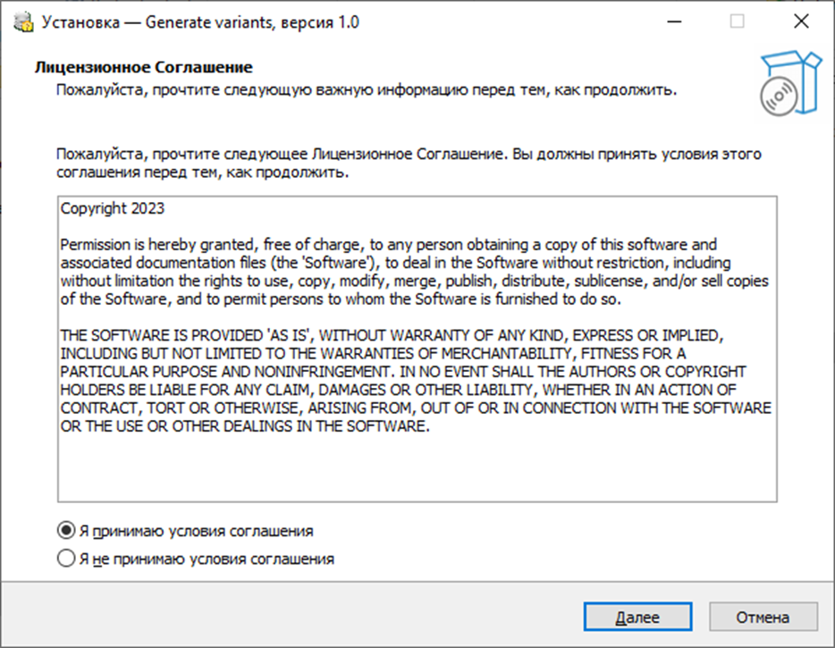

## Введение

Важнейшим аспектом процесса обучения является проверка знаний. Она позволяет оценить прогресс учащегося, указать на его сильные и слабые стороны, закрепить изученный материал. Для эффективного контроля качества освоения учебных дисциплин необходимо создать как можно больше вариантов контрольных заданий. Однако составление вариантов вручную требует много времени.

Генератор вариантов упрощает процесс создания большого числа вариантов заданий для послдующего использования их в курсах по базам данных.
Обратите внимание, что перед началом генерации у вас должна быть создана PostgreSQL база данных. Демонстрационную базу можно загрузить с помощью [этого скрипта](demo_db/demo_db_script.zip). Описание демонстрационной базы можно прочитать [здесь](demo_db/demo_db_description.pdf).

Для запуска приложения вам также потребуется выполнить следующие команды: `pip install tkinter`, `pip install customtkinter`, `pip install Pmw`, `pip install numpy`, `pip install psycopg2.

Для инсталляции приложения в операционной системе WINDOWS можно воспользоваться [инсталлятором](demo_db/GenerateVariants_WINDOWS_v1.0.exe).

## Инструкция по установке приложения:
### Требования к системе
- Операционная система: Windows 10 и выше.

- Свободное дисковое пространство: 100 Mб.

#### 1. Запустить установщик GenerateVariants_WINDOWS_v1.0.exe и выбрать для него язык интерфейса (русский или английский):

#### 2. Прочитать и принять лицензионное соглашение, нажать кнопку «Далее»

#### 3. Выбрать папку установки приложения, по умолчанию будет выбрана «C:\Program Files (x86)\Generate variants».  Нажать кнопку «Далее»

#### 4. В качестве дополнительной опции можно выбрать создание ярлыка на рабочем столе. Нажать кнопку «Далее»

#### 5. Для начала установки нажать кнопку «Установить»

#### 6. Для завершения установки нажать кнопку «Завершить». Если выбрана опция 
«Запустить nero_v1.0», приложение сразу откроется.

## Инструкция по работе с приложением:
### Этапы
1. [Подключение к базе](#bd_connect)
2. [Добавление параметров](#param)
3. [Добавление шаблонов](#templ)
4. [Генерация и выгрузка вариантов](#var)

### 1) Подключение к базе
Перед началом работы с приложением необходимо подключиться к базе данных, на основе которой будут генерироваться задания. 
Для этого необходимо ввести Имя базы данных, Имя пользователя (по умолчанию, postgres), Пароль и Хост (по умолчанию, localhost). 
Далее нажать Подключиться. После успешного подключения появится надпись Подключено.

### 2) Добавление параметров
Далее необходимо добавить параметры. Параметры – выражения, которые записываются в шаблон на места изменяемых значений. Чтобы программа понимала, какие значения в какие места подставлять, для каждого параметра надо указать запрос получения этих значений. При этом любой параметр может быть использован в нескольких шаблонах.
Например, 
| Имя параметра	| Запрос |
| --- | --- |
|PT_FIRST_NAME |	`SELECT first_name FROM visitor ORDER BY random() LIMIT 1` |
|PT_STARTS_ON	| `SELECT starts_on::date FROM schedule ORDER BY random() LIMIT 1` |

Больше примеров [здесь](demo_db/parameters)

Параметры записываются в отдельную таблицу. Если в базе ещё не этой таблицы, будет предложено её создать.

  
Описание таблицы.

  
  
  | Name | Data type | Constraints | Description |
| --- | --- | --- | --- |
| parameter_id  | integer | PK | Идентификатор параметра |
| parameter_name | varchar(300) | NOT NULL, UNIQUE | Имя параметра |
| parameter_query | varchar(1000) | - | Запрос, по которому будет происходить выбор значения на место параметра |

Форма Параметры позволяет просмотреть информацию о параметрах, а также добавлять, изменять или удалять их.

  
Добавить параметр.

  Нажмите Добавить параметр. В появившемся окне заполните имя параметра и SQL-запрос. Имя должно начинаться с PT_. 
  Запрос должен возвращать одно случайное значение. Нажмите Добавить или клавишу Enter. Имя параметра должно быть уникальным. 

  
Изменить параметр.

  ЛКМ выберите параметр в списке и нажмите Изменить параметр. В появившемся окне измените имя или запрос. Нажмите Сохранить изменения или клавишу Enter. 
  Чтобы снять выделение, нажмите на выделенный параметр ПКМ.

  
Удалить параметр.

  ЛКМ выберите параметр в списке и нажмите Удалить параметр. Параметр будет удалён. Чтобы снять выделение, нажмите на выделенный параметр ПКМ.

### 3) Добавление шаблонов
Далее необходимо добавить шаблоны. Шаблоны – задания, в которых на местах изменяемых значений записаны параметры. На основе шаблонов генерируются варианты. 
Шаблоны включают шаблон текста задания, а также шаблон SQL-запроса, по которому можно найти правильный ответ.
Например, 
| Текст | Запрос | Сложность |
| --- | --- | --- |
|Выведите фамилии посетителей  с именем PT_FIRST_NAME или PT_FIRST_NAME | `SELECT last_name FROM visitor WHERE first_name = 'PT_FIRST_NAME' OR first_name = 'PT_FIRST_NAME'`	| 2 |
|Выведите минимальную цену  по которой проводились экскурсии PT_STARTS_ON	| `SELECT MIN(excursion.price) FROM excursion, schedule WHERE excursion.excursion_id = schedule.excursion_id AND schedule.starts_on ::text LIKE PT_STARTS_ON%`	| 7 |

Больше примеров [здесь](demo_db/tasks.txt)

Шаблоны записываются в отдельную таблицу. Если в базе ещё нет этой таблицы, будет предложено её создать. 

  
Описание таблицы.

  

| Name | Data type | Constraints | Description |
| --- | --- | --- | --- |
| template_id | integer | PK | Идентификатор шаблона|
| template_text | varchar(1000) | - | Шаблон текста задания |
| template_query | varchar(1000) | - | Шаблон запроса |
| level | integer  | - | Уровень сложности задания |
 

Форма Шаблоны позволяет просмотреть информацию о шаблонах, а также добавлять, изменять или удалять их.

  
Добавить шаблон.

 Нажмите Добавить шаблон. В появившемся окне заполните шаблон текста и шаблон SQL-запроса. Укажите сложность задания по шкале от 1 до 10. Нажмите Добавить или клавишу Enter. 

  
Изменить шаблон.

   ЛКМ выберите шаблон в списке и нажмите Изменить шаблон. В появившемся окне измените шаблон текста, шаблон SQL-запроса или сложность. Нажмите Сохранить изменения или клавишу Enter. Чтобы снять выделение, нажмите на выделенный шаблон ПКМ.

  
Удалить шаблон.

  ЛКМ выберите шаблон в списке и нажмите Удалить шаблон. Шаблон будет удалён. Чтобы снять выделение, нажмите на выделенный шаблон ПКМ.

### 4) Генерация и выгрузка вариантов
Теперь можно генерировать и выгружать варианты.
Варианты – конкретные задания, созданные по шаблонам, а также ответы к ним.
Варианты записываются в отдельную таблицу. Если в базе ещё нет этой таблицы, будет предложено её создать. Если в базе ещё нет таблице шаблонов, сначала добавьте таблицу шаблонов [(см п.3)](#templ)

 
  
Описание таблицы.

  
  
  | Name | Data type | Constraints | Description |
| --- | --- | --- | --- |
| variant_id  | integer | PK | Идентификатор задания |
| template_id  | integer | NOT NULL, FK | Ссылка на шаблон |
| parameters | varchar(300)[] | - | Значения параметров задания |
| variant_text | varchar(1000)  | - | Текст задания |
| result | varchar(300)[] | - | Правильный ответ на задание |  

Форма Варианты позволяет просмотреть информацию о вариантах, а также генерировать, выгружать или удалять их. Также можно отсортировать варианты по id шаблона и сложности заданий.

  
Сгенерировать варианты.

Нажмите Сгенерировать варианты. В появившемся окне укажите сколько должно быть вариантов и выберите шаблон, по которому они будут генерироваться. Нажмите Сгенерировать или клавишу Enter. Если генерация прошла успешно, вы увидите соответствующее сообщение. Иногда в процессе генерации могут возникать дубликаты, информация о которых выведется в сообщении.

  
Удалить вариант.

ЛКМ выберите вариант в списке и нажмите Удалить вариант. Вариант будет удалён. Чтобы снять выделение, нажмите на выделенный шаблон ПКМ.

  
Выгрузить.

 Нажмите Выгрузить. В появившемся окне выберите директорию и укажите имя файла. Создастся txt-файл со списком заданий. Будут выгружены только те задания, которые       отображены в текущем списке. То есть, если стоит в фильтре указаны произвольные сложность и id шаблона, будут выгружены все варианты в порядке увеличения id    шаблона. Если указана сложность – будут выгружены только задания определённой сложности. Если указан id шаблона – выгрузятся варианты только одного задания.
    Пример выгруженного заданияможно посмотреть <a href="demo_db/demo_db_load_file.txt">здесь</a>.

Краткая справочная информация доступна во вкладке Помощь.
Подробнее ознакомиться с работой можно  <a href="paperwork.pdf">здесь</a>.
